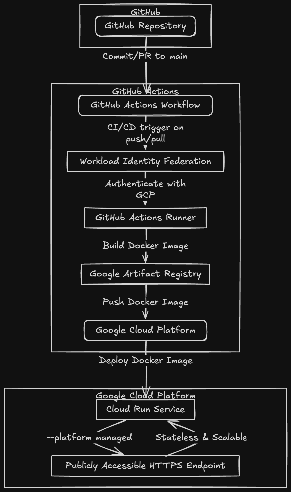

# Stage Assignment - My List Feature API

A Node.js backend service that implements a "My List" feature similar to streaming platforms, allowing users to manage their watchlist of movies and TV shows.

## Features

- Add content (movies/TV shows) to personal watchlist
- Remove content from watchlist
- Fetch personalized watchlist with pagination and filtering
- Cache implementation for improved performance
- Rate limiting for API protection
- Authentication middleware
- Comprehensive error handling

## Tech Stack

- Node.js & Express.js
- TypeScript
- MongoDB with Mongoose
- Jest for testing
- Winston for logging
- Node-Cache for caching
- Docker
- GitHub Actions for CI/CD
- Google Cloud Run for deployment

## API Endpoints

### Health Check

```
GET /api/health
```

### My List Operations

```
POST /api/v1/my-list          - Add content to watchlist
DELETE /api/v1/my-list/:id    - Remove content from watchlist
GET /api/v1/my-list          - Fetch watchlist with pagination and filters
```

## Getting Started

### Prerequisites

- Node.js (v20 recommended)
- MongoDB
- Docker (optional)

### Environment Variables

Create a `.env` file in the root directory:

```
NODE_ENV=dev
PORT=3000
MONGO_DB_URL=mongodb://localhost:27017/stage-api
```

### Installation

1. Clone the repository:

```bash
git clone https://github.com/sahiljamwal/stage-api.git
cd stage-api
```

2. Install dependencies:

```bash
npm install
```

3. Seed the database:

```bash
npm run seed
```

4. Start the development server:

```bash
npm run dev
```

### Running Tests

```bash
# Run all tests
npm test

# Run tests with coverage
npm run test:coverage

# Run tests in watch mode
npm run test:watch
```

### Building for Production

```bash
npm run build
npm start
```

### Docker Support

Build the image:

```bash
docker build -t stage-assignment .
```

Run the container:

```bash
docker run -p 3000:3000 stage-assignment
```

## Deployment

The project is configured for automatic deployment to Google Cloud Run using GitHub Actions. The workflow is triggered on:

- Push to main branch
- Pull requests to main branch

Required secrets for deployment:

- GCP_PROJECT_NUMBER
- GCP_SA_EMAIL
- GCP_REGION
- GCP_PROJECT_ID
- GCP_REPO_NAME
- GCP_APP_NAME



## Design Choices & Implementation Details

### Architecture & Performance Optimizations

1. **Caching Strategy**

   - Implemented in-memory caching using Node-Cache
   - Cache invalidation on watchlist modifications
   - Configurable TTL for cached items (currently set to 60 seconds)
   - Note: For production, consider using Redis for distributed caching

2. **Database Optimizations**

   - Compound indexes on frequently queried fields
   - Lean queries for better performance
   - Currently using MongoDB free cluster (response times may vary)
   - Mongoose connection pooling (minPoolSize: 5)

3. **API Performance**
   - Pagination implemented for list endpoints
   - Response compression using gzip
   - Rate limiting to prevent abuse
   - Efficient query building with projection

### Scalability Considerations

1. **Horizontal Scaling**

   - Containerized with Docker for easy deployment
   - Stateless architecture enabling multiple instances
   - Cloud Run for automatic scaling

2. **Database Scalability**

   - MongoDB schema designed for sharding
   - Indexes optimized for read-heavy operations
   - Separate collections for movies, TV shows, and watchlists

3. **Code Organization**
   - Modular architecture for easy maintenance
   - Version-based API routing
   - Separation of concerns (controllers, services, schemas)

### Assumptions & Limitations

1. **Authentication**
   - Currently using a mock authentication system
   - Random user selection from predefined IDs
   - In production, implement proper JWT authentication

```typescript
// Current auth middleware (mock implementation)
const users = [
  "681ef3592194900a40fa0a06",
  //  "681ef3592194900a40fa0a07"
];
```

2. **Performance Considerations**

   - Using Node-Cache instead of Redis (suitable for single instance)
   - Free MongoDB cluster may have performance limitations
   - Expected response times may vary in production

3. **Data Management**
   - Content (movies/TV shows) is considered relatively static
   - User watchlists are frequently updated
   - Assumes moderate user base size

### Known Trade-offs

1. **Caching**

   - In-memory cache doesn't persist across restarts
   - Node-Cache isn't suitable for multiple instances
   - Consider Redis for production deployment

2. **Database**

   - Free MongoDB cluster has limited connections
   - Periodic connection drops may occur
   - Upgrade to dedicated cluster for production

3. **API Design**
   - Limited error response localization
   - Basic rate limiting implementation
   - Minimal input sanitization

## License

ISC Licensed. See LICENSE for details.
